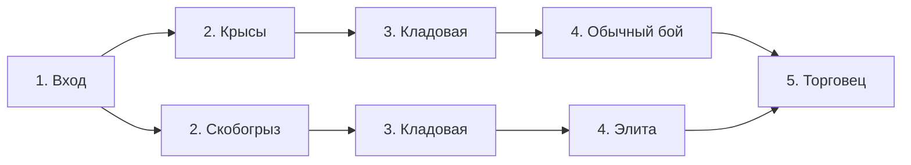

# Дворец слов: предметы, которые меняют игру

Геймдизайн v0.2 · 9 сентября 2026

**Статус: этапы 1–2 внедрены 9 сентября 2026.** Пять поведений оружия, независимое качество, заточка, ранний пул реликвий, три готовые сборки и предварительный результат сдвига: [этап 1](weapon-builds-v02.md). Связанные ветки карты, кладовые, разные награды, три печати Цензора и раздельные последовательности случайности: [этап 2](route-rewards-v02.md). Старые активные сохранения продолжаются по прежним правилам. Этапы 3–4 ниже остаются планом; числа не являются подтверждённым балансом.

Исходный аудит выполнен по ветке `feat/flooded-archive`, коммиту `ca4db17`. Раздел «Что уже работает» описывает состояние до этой итерации.

## 1. Главное решение

**Один и тот же ход на поле должен иметь разную ценность в разных забегах.** С топором игрок ищет длинные комбинации клинков. С ядовитым кинжалом распределяет заражение и защищается, пока яд действует. С рунным мечом превращает атаки в подготовку заклинания. Находка должна вызывать мысль: «Теперь я могу играть иначе».

Основой остаётся пошаговый match-3 с циклическим сдвигом строки или столбца. Главный источник разнообразия — взаимодействия предметов, оружия и поля. Карта, экономика и намерения врагов дают причины выбирать между этими возможностями.

Из Isaac беру накопление взаимодействующих находок, изменение героя в течение забега, открытия и желание попробовать неожиданное сочетание. В своём постмортеме Эдмунд Макмиллен связывает ощущение роста с находками и наградами за боссов, а повторные прохождения — с открытием нового содержимого и ощущением неизвестности. Это материал об оригинальном Isaac 2011 года, а не точная спецификация Rebirth. [Постмортем автора](https://www.gamedeveloper.com/business/postmortem-mcmillen-and-himsl-s-i-the-binding-of-isaac-i-).

Влияние Slay the Spire в нашем проекте — планирование маршрута, читаемые намерения, стоимость лечения и выбор усиления под текущую сборку. **Рабочая формула: находки меняют правила; поле проверяет, умеет ли игрок ими пользоваться; маршрут позволяет сознательно рисковать ради следующей находки.** Все конкретные правила далее — предложение для нашей игры.

Признак успеха: после забега игрок может рассказать про свою сборку и несколько решений, а не только назвать максимальный урон и последнего врага.

## 2. Что уже работает и что мешает глубине

Сейчас есть хорошая основа: четыре семейства фишек, управление полем через фокус, способности до или после сдвига, яд, каскады, предметные взаимодействия, сохранение seed, два биома и разные намерения врагов. Прилив и кляксы уже добавляют Архиву собственные задачи. Эти системы стоит развивать вместе.

| Наблюдение по текущему коду                                                                               | Последствие для игры                                            | Предлагаемое изменение                                                    |
| --------------------------------------------------------------------------------------------------------- | --------------------------------------------------------------- | ------------------------------------------------------------------------- |
| Пять оружий дают последовательно +0…+4 урона за группу; замена на равную или меньшую прибавку запрещена   | Новое оружие в основном является следующей ступенью одной шкалы | Отделить тип оружия от качества; тип меняет поведение атаки               |
| На новом профиле доступны две из двенадцати реликвий                                                      | Первый забег показывает только небольшую часть взаимодействий   | Базовые способы собрать интересный билд доступны сразу                    |
| Первая награда почти фиксирована; позднее есть гарантированная подстановка конкретной синергии            | Повторяются знакомые начала и цепочки находок                   | Ранний выбор направления сохраняется, конкретная цепочка не гарантируется |
| Обычный бой, элита и первый босс используют одну функцию предложения наград без отдельной категории босса | Риск и кульминация недостаточно выражены наградой               | Разные источники вещей и особая награда за Цензора                        |
| Доступные комнаты определяются только следующей глубиной                                                  | Развилка слабо влияет на будущие комнаты                        | Ветви связывают выбор на несколько комнат вперёд                          |
| Составы отрядов и варианты комнат заданы по глубинам                                                      | Seed меняет поле и добычу сильнее, чем само приключение         | Отдельно генерировать маршрут и отряды из допустимых шаблонов             |
| Два модификатора поля при двух слотах                                                                     | После получения обоих практически нет выбора состава поля       | Добавить два альтернативных модификатора после проверки оружия            |

Основания: [экипировка](/Users/max/dev/gamedev/oskolki-pixel-original/game/engine.ts:310), [награды и доступные реликвии](/Users/max/dev/gamedev/oskolki-pixel-original/game/engine.ts:1542), [доступные комнаты](/Users/max/dev/gamedev/oskolki-pixel-original/game/engine.ts:1721).

Дополнительно проверены 200 стартовых полей, seed 1–200, базовая экипировка. В среднем доступно **29,235 успешного сдвига из 60 возможных**, диапазон 11–42. Комбинация 4+ доступна на 196 полях, щитов — на 190, фокуса — на 192. Считалась только видимая первая волна, без будущего пополнения. Это не измерение увлекательности: разные сдвиги ещё и оставляют разное поле. Но добавлять больше вариантов перемещения сейчас незачем, а матч 4+ нельзя считать редким событием.

Ранее 30 автоматических прохождений завершились победой. Бот выбирает ход после расчёта будущих каскадов, то есть знает больше игрока. Это свидетельство технической проходимости, а не доказательство подходящей сложности. [Алгоритм бота](/Users/max/dev/gamedev/oskolki-pixel-original/tests/engine.test.mjs:308).

## 3. Рамки следующей версии

Доводим **один режим, одного базового героя, два существующих биома и 20 посещаемых комнат**. Прохождение должно иметь завершённую драматургию: найти направление → собрать взаимодействие → проверить его на Цензоре → приспособиться к Архиву → победить Хранителя.

| Часть         | Решение                                                                                                            |
| ------------- | ------------------------------------------------------------------------------------------------------------------ |
| Поле          | 6×6; четыре семейства; прежний циклический сдвиг                                                                   |
| Ход           | Один успешный сдвиг, одна способность, один расходник; порядок выбирает игрок                                      |
| Правка поля   | Сохраняет общую со способностью квоту: контроль конкурирует с заклинанием                                          |
| Большие матчи | Больше базового эффекта и специальные предметные взаимодействия; дополнительных ходов по умолчанию нет             |
| Сборка        | Одно оружие, шлем при наличии, одежда, штаны; пассивные реликвии накапливаются; два приёма и два модификатора поля |
| Здоровье      | Ресурс всего забега; блок и боевые запасы сбрасываются между боями по текущим правилам                             |
| Темп          | Обычные бои без таймера; испытание на время остаётся добровольной ветвью                                           |
| Сложность     | Фиксирована при старте; враги не усиливаются скрыто в ответ на удачную сборку                                      |

Не расширяем число биомов, героев и валют, пока три заметно разных сборки не станут интересными в существующем прохождении. Это ограничение объёма ближайшей итерации, а не запрет на дальнейшее развитие.

## 4. Бой: понятный риск и приятная неожиданность

Каждый ход должен предлагать хотя бы две **содержательные причины** для действия: добить опасного врага, закрыть входящий удар, накопить ресурс, подготовить сильную комбинацию, устранить угрозу поля. Необязательно гарантировать все ответы на каждом поле: иногда правильное решение — принять небольшой урон ради большего выигрыша.

Перед подтверждением сдвига показываем гарантированный результат первой волны: попадания по целям, блок, энергию, фокус, яд, очищаемые угрозы и расход лимитов предметов. Случайные каскады обозначаем как возможное продолжение без обещания результата. Намерение врага и ожидаемый урон герою обновляются после фактического действия; неизвестный исход не маскируется под точное предсказание.

Урон врагов должен быть понятен по источникам: обычные удары, пробивание, яд, прилив. Если действие изменит фазу босса, предварительный просмотр показывает и это. На поле достаточно подсвечивать выбранный сдвиг и его последствия; постоянная подсветка десятков допустимых ходов создаёт шум.

Случайность даёт разнообразие находок и приятные каскады. Основной план игрок должен уметь построить по видимым данным. Потратить последний фокус ради вероятного продолжения — осознанный риск; умереть от неописанного правила предмета — ошибка дизайна.

### Общие правила взаимодействий

- Совпадение, уничтожение бомбой, удар оружием, заклинание и ответный урон — разные источники. «За совпадение» не срабатывает от простого удаления клетки.
- Пересекающиеся линии одного семейства считаются одной группой; клетка оплачивает базовый эффект один раз за волну. Уже уничтоженную клетку нельзя повторно оплатить соседним взрывом.
- Бомба может запускать соседнюю бомбу, но каждая конкретная бомба взрывается один раз. Каскад действительно создаёт новые совпадения и может снова активировать соответствующие предметы.
- Обычное попадание после гибели цели переводится на следующую живую цель. Избыток урона сам по себе не переносится: для этого нужен явно описанный эффект.
- Полученный от предмета дополнительный урон не считается новой атакой оружием. Это позволяет сочетать эффекты без самозапуска одной и той же цепочки.
- Лимит «раз за ход» или «раз за бой» всегда написан на предмете. Применяем его там, где иначе возникает бесконечный ресурс или бесплатное лечение, а не ко всем эффектам подряд.

Редкая мощная цепочка, которая быстро уничтожила отряд, — допустимая награда за сборку. Бесконечный цикл без расхода ресурса, зависание и лечение до максимума на специально оставленном враге — дефекты. Босс не получает скрытую неуязвимость только потому, что игрок собрал много урона.

## 5. Пять оружий: пять способов использовать клинки

Сохраняем существующие изображения, включая оружие в руках и на поле. Меняем правила. **Тип оружия и его качество становятся независимыми.** Игрок может улучшать любимый кинжал, а не обязан в конце перейти на меч.

Для таблицы `D = 2 × число клинков в группе + бонус улучшения семейства + качество оружия`. Качество: 0, 1 или 2. Бонус качества применяется один раз на группу. Это исходная формула для сравнения, не окончательное соотношение урона и здоровья врагов.

| Оружие             | Новое правило                                                                                                                                                  | Как меняет решения                                                                                   |
| ------------------ | -------------------------------------------------------------------------------------------------------------------------------------------------------------- | ---------------------------------------------------------------------------------------------------- |
| **Нож для бумаги** | Наносит D. До 2 урона каждого попадания игнорирует блок; остаток проходит через обычный блок                                                                   | Надёжные точечные атаки; помогает не тратить заклинание на слабую броню                              |
| **Ржавый кинжал**  | Наносит максимум из 0 и D−2; выжившей цели добавляет 2 яда за группу                                                                                           | Выгодно заразить нескольких врагов, затем защищаться; хуже для немедленного добивания                |
| **Железный тесак** | Если есть второй враг: треть D с округлением вниз идёт ему, остальное выбранной цели. При одной цели весь D идёт ей                                            | Сильнее против отрядов; распределение урона может помешать срочно убрать одного опасного врага       |
| **Боевой топор**   | Группа из трёх: D−2, минимум 0. Группа из четырёх и более: D+4                                                                                                 | Поощряет подготовку длинного матча и отказ от удобной тройки; 4+ — условие выбора, не редкий джекпот |
| **Рунный меч**     | Каждая группа наносит максимум из 0 и D−2 и даёт 1 энергию. После первого такого совпадения следующий атакующий приём за энергию в этом ходу получает +2 урона | Важен порядок «сдвиг → приём»; клинки помогают накопить заклинание                                   |

У тесака дополнительная цель выбирается заранее по видимому порядку противников; интерфейс показывает обе цели. Это два попадания оружием, поэтому яд и другие эффекты попадания совместимы с ними. У кинжала яд добавляется после прямого попадания; «Токсичный амулет» не получает задним числом срабатывание по только что заражённой этим же попаданием цели.

Пример без улучшений: тройка даёт ножу 6 прямого урона, кинжалу 4 и 2 яда, топору 4. Четвёрка топора даёт 12. Это разные преимущества, которые сравниваются с намерением врага и доступным полем.

Смена оружия происходит только вне боя. Предмет такого же или более низкого качества можно принять добровольно; показываем, какой эффект теряется и какой появляется. Добытое оружие имеет своё качество, автоматического переноса заточки между разными находками нет. Улучшение в кузнице/на привале повышает качество текущего оружия на одну ступень до максимума. Запасной склад оружия на первую итерацию не нужен.

Шлем, одежда и штаны пока сохраняют простую роль роста: здоровье, защита, запас фокуса. Их текущих прибавок достаточно для фонового усиления; основную сложность выбора несут оружие, реликвии и модификаторы. Переодевание не должно становиться источником бесконечного лечения через повторное надевание шлема.

## 6. Сборки, которые можно собрать несколькими путями

У каждой сборки должны быть два независимых входа: оружие или предмет, модификатор или реликвия. Игрок не обязан найти три конкретные вещи в заданном порядке. Находка, которая работает только с ещё не найденной вещью, — осознанная инвестиция; такие находки не заполняют первую награду.

| Направление          | Вход и развитие                                                      | Поведение игрока                                                              | Естественная слабость                                                       |
| -------------------- | -------------------------------------------------------------------- | ----------------------------------------------------------------------------- | --------------------------------------------------------------------------- |
| **Ответная защита**  | Шипованный обод либо Медная катушка → одежда, Стойка, Обратная тяга  | Собирает щиты под реальные атаки; накапливает энергию для ответного хода      | Пробивание, подготовка противника вместо удара, затягивание боя             |
| **Заражение**        | Кинжал либо Ядовитые клинки → Токсичный амулет, Грибное сердце       | Распределяет яд, выбирает кого добить сразу, защищается во время его действия | Враги, которых необходимо убрать немедленно; короткий бой                   |
| **Взрывная цепочка** | Пороховая искра либо Стеклянная призма → Проводник, Разряд           | Ищет разрушение и каскады, превращает их в заклинание                         | Нельзя заранее рассчитывать на случайный каскад; лимит способности остаётся |
| **Рунный разряд**    | Рунный меч либо Медная катушка → Лампа, энергетический приём         | Решает, потратить энергию сейчас или подготовить переполнение                 | Похищение энергии; слабее прямой урон без возможности применить приём       |
| **Редактор поля**    | Камень порядка либо топор → запас фокуса, Перекройка, Копирка        | Тратит фокус на создание нужной геометрии и устранение угроз                  | Правка занимает место заклинания; фокус нужно накопить                      |
| **Алая сделка**      | Кровавый выпад либо Алая линза → Сосуд, Печать, ограниченное лечение | Платит здоровьем за быстрый бой и меньше ответов врага                        | Длинный маршрут без лечения; ошибочная оценка летального урона              |

Три направления для первой проверки: заражение, редактор с топором, рунный разряд. Защитная цепочка уже существует и служит сравнением. Остальные не требуют отдельного режима или героя.

### Точечные изменения реликвий

Большинство существующих предметов сохраняем. Меняем несколько правил, которые лучше показывают разные способы игры:

| Предмет                   | Предложение                                                                                                                                                                           | Зачем                                                                                     |
| ------------------------- | ------------------------------------------------------------------------------------------------------------------------------------------------------------------------------------- | ----------------------------------------------------------------------------------------- |
| Шипованный обод           | После каждого вражеского удара наносит его источнику половину **реально поглощённого этим ударом блока**, округляя вниз. Прилив и другие опасности окружения не имеют цели для ответа | Защита становится ответом на намерение, а не универсальной бесплатной атакой от щитов     |
| Кровяной сосуд            | После первой оплаты здоровьем **за ход** следующий матч клинков в этом ходу даёт 4 блока                                                                                              | Сборка жертвы работает в течение боя; блок не возвращает заплаченное здоровье             |
| Копирка — новая           | После Правки следующий матч клинков в том же ходу наносит +3 урона. Один раз за ход                                                                                                   | Правка превращается в подготовку атаки; может усилить совпадение, созданное самой правкой |
| Заразная закладка — новая | После гибели отравленного врага переносит половину оставшегося у него яда, округляя вниз, следующему живому врагу. Без немедленного дополнительного тика                              | Заражение получает развитие против отрядов; избыточный яд перестаёт полностью пропадать   |

«Медная катушка», «Обратная тяга», «Токсичный амулет», «Грибное сердце», «Стеклянная призма», «Проводник», «Камень порядка», «Алая линза», «Переполненная лампа» и «Ритуальная нить» на первом сравнении сохраняют существующие формулы. Ограничение лечения Сердца и Нити одним срабатыванием за бой сохраняется. Для переноса яда после смертельного тика берём значение после обычного уменьшения длительности этого тика.

Это даёт проверяемый пул из 14 обычных реликвий вместо немедленной разработки десятков новых.

### Четыре модификатора на два слота

Сохраняем Ядовитые клинки и Пороховую искру. Затем добавляем:

- **Шипованный щит:** четверть новых щитов получает метку; собранная отмеченная фишка наносит 1 урон выбранной цели. Удаление взрывом не считается совпадением.
- **Точная пометка:** четверть новых фишек фокуса получает метку; совпадение, содержащее хотя бы одну такую фишку, даёт 3 блока, один раз за ход.

По-прежнему четыре семейства: отмеченные фишки собираются с обычными. Новые метки не являются пятым цветом. Выбор между бомбами, ядом, прямым уроном от щитов и защитой от фокуса становится частью сборки.

## 7. Пример содержательного хода

У героя топор без заточки, Копирка, 3 фокуса, 6 энергии и возможность сделать сдвиг. У выбранного врага 14 здоровья; его следующий удар — 10. Второй враг имеет 25 здоровья и сейчас готовится, поэтому в этой фазе не атакует. Предположим, видимое поле допускает следующие варианты:

1. **Щиты + Разряд.** Тройка щитов даёт 6 блока. Разряд тратит 6 энергии и наносит 12. Враг выживает, герой теряет 4 здоровья. Ресурсы потрачены, но поле сохранено под следующий ход.
2. **Клинки + Разряд.** Обычная тройка с топором наносит 4; Разряд добивает врага. Герой сохраняет здоровье и фокус, но тратит 6 энергии.
3. **Правка + длинный матч.** За 3 фокуса Правка подготавливает четвёрку без немедленного совпадения. Сдвиг собирает её: 8 базового +4 топора +3 Копирки = 15. Враг погибает. Герой сохраняет энергию, но расходует фокус и квоту способности.

Все варианты посчитаны без случайных каскадов. Первый вариант уступает двум добиваниям в текущем обмене здоровьем; второй и третий оставляют разные ресурсы и разное поле для оставшегося врага. Здесь игрок выбирает, нужен ли ему дальше фокус для контроля или энергия для приёма. В одиночном бою, который закончится сейчас, сохраняемые боевые ресурсы обнулятся: интерфейс и обучение должны честно это объяснять.

В Архиве тот же выбор осложняется кляксами и приливом. Новые правила добавляются к освоенным решениям, а не заменяют их.

## 8. Находки и награды: разные поводы радоваться

Нужен ритм крупных открытий и небольшого роста. Если после каждого врага выдавать одинаковое сравнение четырёх предметов, сильная находка теряет вес, а чтение замедляет забег.

| Источник                            | Предлагаемая награда                                                                                                                                           |
| ----------------------------------- | -------------------------------------------------------------------------------------------------------------------------------------------------------------- |
| Первый бой забега                   | Один выбор из трёх: новый тип оружия, модификатор поля, самостоятельно полезная реликвия. Конкретные предложения меняются от seed                              |
| Обычный бой                         | 12–18 золота и выбор одной из двух наград: экипировка/качество/улучшение семейства и приём/модификатор. При исчерпании категории — допустимая замена из другой |
| Кладовая, одна обязательная в биоме | Одна видимая случайная реликвия бесплатно. Можно принять, оставить или один раз заменить предложение за 20 золота; результат замены неизвестен заранее         |
| Элита                               | 25–35 золота; выбор одной из трёх реликвий или модификаторов. Реликвия гарантированно есть среди вариантов                                                     |
| Цензор                              | 40 золота; выбор одной из трёх особых печатей, затем переход в Архив                                                                                           |
| Хранитель прилива                   | Итог забега, открытие и запись победы; бессмысленной награды после финала нет                                                                                  |
| Магазин и события                   | Направленное усиление или обмен ресурса на шанс изменить сборку                                                                                                |

Обычную награду можно **целиком** обменять на 8 золота. Это замена выбора, а не дополнительная выплата за каждую отклонённую вещь. Отказ от бесплатной реликвии в кладовой не оплачивается: её уже можно безопасно оставить.

Цель — примерно **6–10 пассивных реликвий** к финалу на обычном маршруте с несколькими покупками/рисками. Это не гарантированная раздача: более безопасный маршрут вправе дать меньше. Частоты сверяем по сгенерированным маршрутам, прежде чем увеличивать пул вещей.

Первая награда не содержит предметов без применения в текущем состоянии. Позднее такие предложения допустимы, но экран отмечает зависимость: «Нужен приём с ценой в здоровье». Не гарантируем следующую часть уже начатой цепочки. Предложения различаются по роли; нельзя получить три одинаковые по смыслу прибавки к урону.

### Три печати Цензора

| Печать                 | Польза                                                                                                                   | Цена                                                              |
| ---------------------- | ------------------------------------------------------------------------------------------------------------------------ | ----------------------------------------------------------------- |
| **Красная строка**     | +4 урона каждому матчу клинков                                                                                           | −8 максимального здоровья; текущее обрезается до нового максимума |
| **Несгораемая запись** | До 6 неиспользованного блока сохраняется на следующий раунд                                                              | Каждый матч щитов даёт на 2 блока меньше, минимум 0               |
| **Двойная правка**     | Правка меняет две выбранные разные клетки на одно выбранное семейство за прежние 3 фокуса; разрешается после обеих замен | Атакующие приёмы наносят на 3 урона меньше, минимум 0             |

У первой версии все три печати видны. Игрок может отказаться от выбора без штрафа. Перед принятием показываем действие на текущую сборку. Цена максимальным здоровьем применяется до межбиомного лечения, лечение считается от нового максимума.

## 9. Карта: решение на несколько комнат вперёд

Узлы должны иметь настоящие связи. После выбора ветви следующие две-три комнаты зависят от него; уже отвергнутый путь нельзя выбрать на следующей глубине без нарисованного перехода. Награды известных типов видны заранее, конкретная находка в ещё не посещённой кладовой скрыта.

Сохраняем десять посещений на биом. Магазин на глубине 5, привал на 9 и босс на 10 — общие точки. Вторая половина забега повторяет структуру на глубинах 11–20.

Пример первой части карты; обе ветви имеют свою кладовую, поэтому она не возвращает игрока на общий путь:

Вторая часть: бой на 6 → событие/испытание на 7 → обычный бой/элита на 8 → привал на 9 → босс. Связи между 6, 7 и 8 также ограничены. В конкретном seed одна ветвь может вести через безопасное событие, другая — через выгодный риск. Ветка выбирается с учётом видимой элиты впереди.

Проверяемые ограничения генератора:

- На любом полном пути есть три обычных боя на глубинах 1, 2, 6, одна кладовая, магазин, привал и босс. На глубинах 4 и 8 — обычные бои либо элиты.
- Не более двух элит на биом; существует полный путь без элит и испытания на время.
- Две ветви не отличаются только названиями одинаковых встреч. На них различаются хотя бы риск отряда или последующая награда/событие.
- Ни один предмет, ключ или платёж не обязателен для продолжения. Для первого прохода новые ключи и отдельные валюты не нужны.
- Перед обязательным боем нельзя принудительно получить сочетание двух ограничителей управления полем. Первый показ новой опасности происходит отдельно от другой новой опасности.

У карты, отрядов, добычи и пополнения поля должны быть независимые последовательности случайности, производные от seed. Тогда лишний каскад не меняет будущий магазин и маршрут. Повтор seed воспроизводит приключение при той же версии правил и наборе открытий; одного числа без этих условий недостаточно. Просмотр карты, перезагрузка и повторное открытие награды ничего не перебрасывают.

## 10. Экономика: здоровье и золото конкурируют за будущее

Начальные 25 золота сохраняем. Два обычных боя до первого магазина и ещё один бой/элита дают ориентировочно 61–96 золота без событий и обмена наград. Это позволяет сделать одну важную покупку либо несколько небольших, а не забрать весь прилавок.

| Покупка                                           | Начальная цена для проверки |
| ------------------------------------------------- | --------------------------: |
| Зелье, лечение на 8                               |                          25 |
| Улучшение семейства или заточка оружия на ступень |                          40 |
| Приём                                             |                          40 |
| Модификатор поля                                  |                          55 |
| Обычная реликвия                                  |                          65 |
| Экипировка                                        |    25 / 40 / 65 по качеству |
| Замена предложения в кладовой, один раз           |                          20 |
| Ремонт насоса в Архиве                            |                          30 |

Скидки 20/30/40% остаются на части товаров, зафиксированы для магазина. Торговец может дать короткую подсказку о связи товара с предметом игрока, но не объявляет покупку «правильной». Предмет продаётся один раз; повторный вход не обновляет запас и цены.

На привале выбор один: лечение 25% максимального здоровья с округлением вверх, улучшение семейства либо заточка текущего оружия. Лечение в 8–12 здоровья часто означает отказ от усиления, которое могло бы сэкономить это здоровье позже.

Нынешнее лечение на 50% максимума и зелье после Цензора пока оставляем как исходную точку. Отдельно измеряем, насколько оно обесценивает последние рискованные комнаты Подвала. Если почти любой путь приходит в Архив полностью здоровым, сравниваем с лечением 25%; не меняем одновременно с уроном всех врагов.

События имеют видимую цену и возможность уйти. Примеры: отдать 6 текущего здоровья за редкую находку; заплатить 30 золота за насос, ослабляющий будущие приливы; забрать небольшую бесплатную награду и отказаться от риска. Платёж здоровьем, который убьёт героя, недоступен и объяснён. Все случайные варианты заранее закреплены за событием, повторное открытие окна не позволяет искать удачный результат.

## 11. Враги проверяют решения сборки

Количество существующих врагов уже достаточно для следующей итерации. Важнее разные роли и сочетания. Один и тот же противник интереснее рядом с подходящим напарником, чем с дополнительными 20 здоровья.

| Роль                 | Существующие примеры                | Вопрос игроку                                                         |
| -------------------- | ----------------------------------- | --------------------------------------------------------------------- |
| Непрерывное давление | Крыса, налётчик                     | Могу ли я быстро убрать источник регулярного урона?                   |
| Подготовленный удар  | Ластик, звонарь, якорный смотритель | Успею ли добить его или лучше заранее накопить защиту?                |
| Защита               | Скобогрыз, сейф, краб               | Атаковать сейчас, пробить блок, наложить яд или заняться напарником?  |
| Похищение ресурсов   | Моль, буквоед                       | Потратить накопленное до кражи или устранить вора?                    |
| Давление на поле     | Архивариус, писарь                  | Устранить опасность сейчас или закончить бой раньше её срабатывания?  |
| Лечение              | Огарок, удильщик                    | Собрать сильный ход к моменту лечения или сначала убрать другую цель? |

Отряд «сейф + моль» проверяет приоритет цели: защищённый враг не обязательно самый срочный. «Писарь + крыса» заставляет сравнивать очистку с немедленной защитой. «Якорный смотритель + удильщик» даёт окно подготовки, но наказывает бесконечное ожидание.

Такие отряды подбираются из проверенных шаблонов по стадии биома; случайный набор трёх любых врагов не годится. Не вводим полную невосприимчивость к яду или заклинаниям ради «контрсборок». У сильного билда остаются слабые ситуации, но его находки продолжают работать.

### Подвал и Цензор

Подвал знакомит с базовыми ролями, короткими цепочками предметов и ценой здоровья. До первой элиты игрок уже получил стартовый выбор и кладовую.

Цензор проверяет подготовку к тяжёлому удару и работу с ограничением поля. Сохраняем две фазы. При переходе фазы ясно показываем усиленное намерение до следующего подтверждения хода. Не добавляем отдельную мини-игру или внезапное запрещение семейства, которое составляет основу сборки.

### Архив и Хранитель прилива

Вторая половина проверяет уже собранный способ игры через **прилив, кляксы и порядок устранения врагов**. Это достаточно новых задач для одного биома.

Прилив сейчас отменяется любым совпадением в отмеченной строке за три ответа врагов. Проверяем, насколько часто он случайно исчезает без решения игрока. Если в наблюдениях отмена почти всегда побочная, следующая гипотеза — открывать сток совпадением именно первой волны ручного сдвига либо явной Правкой, сохраняя доступный способ ответа. Сначала проверка, затем изменение: большая опасность сама по себе не означает больший интерес.

Для клякс сохраняем несколько ответов: совпадение фокуса, точная Правка, безопасное разрушение бомбой, убийство писаря, сознательная плата здоровьем. Отсутствие одного конкретного модификатора не блокирует прохождение. На первом знакомстве с кляксами не добавляем одновременно кражу фокуса и связывание поля.

Хранитель соединяет знакомые правила, усиливает их после половины здоровья и оставляет видимые окна для атаки. Победа над ним должна подтверждать работу сборки; обязательные неуязвимые фазы и скрытые ограничения урона для её искусственного затягивания не нужны.

## 12. Открытия и возвращение в игру

В стартовом пуле доступны все 12 нынешних обычных реликвий. Первый выбор фильтруется на самостоятельную полезность. Это даёт новичку инструменты для интересного забега до достижения первой победы.

Новые открытия добавляют альтернативы: Копирка за несколько успешных Правок, Закладка за победы над отравленными отрядами, новые модификаторы за использование соответствующего семейства. Условие видимо заранее; награда не требует десятков повторов одного действия. Уже полученные открытия сохраняются при смене правил достижений.

Постоянные +5% здоровья или урона между попытками не вводим. Рост мастерства — лучшее понимание поля, цены здоровья и возможностей предметов; метапрогрессия расширяет выбор. Найденные предметы сохраняются в справочнике с точными описаниями и обнаруженными сочетаниями.

После смерти показываем источник последнего урона, несколько ключевых предметов, глубину, seed и версию правил. Можно начать новый случайный забег или повторить тот же. Статистика обычного режима, повторов seed и изменённых настроек разделена.

## 13. Как понять, что играть стало интереснее

Числа помогают находить проблемы, но не объясняют их сами. В докладе о балансе Slay the Spire Энтони Джованнетти описывает совместное использование метрик, обратной связи и частых итераций; отдельно предостерегает от выводов только по данным. Этот подход принимаем для проверки нашей системы. [Доклад GDC 2019](https://media.gdcvault.com/gdc2019/presentations/Giovannetti_Anthony_SlayTheSpire.pdf).

### Первая серия наблюдений

Шесть игроков: трое впервые видят игру, трое знакомы с текущей версией. По два забега: один с текущими правилами, один с новыми. Для пары прохождений задаём одинаковый seed и набор открытий; порядок версий чередуем между участниками, чтобы уменьшить влияние знакомства с игрой. Отдельно смотрим первое знакомство со свежим профилем, где доступность предметов сама является проверяемым изменением. Перед полным прохождением — короткая проверка понятности управления. Это небольшой качественный тест, не статистическое доказательство.

| Вопрос                       | Что записываем                                                                                 | Как трактуем                                                                     |
| ---------------------------- | ---------------------------------------------------------------------------------------------- | -------------------------------------------------------------------------------- |
| Появилась ли сборка?         | После 4-й комнаты игрок своими словами объясняет, что теперь выгодно собирать                  | Если говорит только «у меня больше урона», взаимодействие недостаточно заметно   |
| Есть ли альтернативы в ходу? | В нескольких выбранных ходах игрок называет два варианта и причину выбора                      | Нужны реальные причины, а не поиск подсвеченного максимума                       |
| Работает ли фокус?           | Накопление, переполнение, траты, причины отказа от Правки                                      | Постоянный полный запас — сигнал, что контроль слишком слаб, дорог или непонятен |
| Отличаются ли оружия?        | Выбор и отказ с учётом доступных альтернатив, использования и текущей сборки                   | Общая доля побед оружия без поправки на момент получения ничего не доказывает    |
| Работает ли маршрут?         | Изменился ли выбор ветви после находки/потери здоровья                                         | Одна и та же ветвь при любых состояниях требует пересмотра риска и наград        |
| Осмыслен ли прилив?          | Намеренные отмены, случайные отмены, сознательно принятый урон                                 | По одному счётчику отмен нельзя судить о принятом решении                        |
| Понятна ли смерть?           | Может ли игрок объяснить последний опасный ход                                                 | Неясные правила исправляем раньше общей сложности                                |
| Хочется ли ещё?              | Добровольное желание начать следующий забег и названное сочетание, которое хочется попробовать | Это прямее связано с целью проекта, чем число созданных предметов                |

Стартовые ориентиры: обычный бой 2–4 раунда, элита 4–6, босс 5–8; полный знакомый игроку забег около 25–40 минут. Особенно удачный билд может пройти бой быстрее. Если время в основном уходит на просмотр десятков сдвигов и чтение, сначала улучшаем представление информации, затем меняем число комнат.

Не задаём сейчас «правильный» процент побед: новой и опытной аудитории нужна разная интерпретация результата. Первые поражения допустимы, если понятны причины и игрок видел, что мог сделать иначе.

### Автоматические проверки для будущей реализации

- Бот для оценки сложности выбирает только по видимому полю и намерениям; не заглядывает в RNG каскада. Текущий бот с полным знанием остаётся технической проверкой.
- Сравниваем одинаковые seed отдельно на свежем профиле и с полным пулом открытий.
- Проверяем все пары оружие × модификатор, перенос яда, взрывы с перекрытием, получение блока, оплату здоровьем, смену фаз и остановку эффектов после смерти.
- Проверяем отсутствие бесконечного лечения и ресурсов; честное объяснение каждого ограничения.
- Генератор проверяется на достижимость босса, путь без элит, число обязательных узлов и независимость маршрута от каскадов.
- Сохранение восстанавливает тип и качество оружия, предметные лимиты, выбранную ветвь, цены, источники случайности и следующие исходы. Старый активный забег продолжает свои прежние правила либо мигрирует с явно показанным результатом.

## 14. Порядок реализации

Не вводим все изменения одной большой заменой: иначе невозможно понять, что улучшило игру, а что ухудшило.

| Этап                                | Объём                                                                                                                                            | Условие перехода дальше                                                                    |
| ----------------------------------- | ------------------------------------------------------------------------------------------------------------------------------------------------ | ------------------------------------------------------------------------------------------ |
| **1. Разные способы атаковать**     | Пять поведений оружия; тип отдельно от качества; ранний доступ к 12 реликвиям; проверка трёх сборок; точные описания и предварительный результат | Игроки замечают разницу и выбирают разные ходы на сопоставимых полях                       |
| **2. Разные способы строить забег** | Настоящие связи карты; кладовые; раздельные категории наград; три печати Цензора; независимый seed для карты/добычи/поля                         | Находки и здоровье меняют выбор маршрута; нет одного очевидно лучшего источника наград     |
| **3. Расширение взаимодействий**    | Копирка и Закладка, два новых модификатора, две правки текущих реликвий; проверенные составы отрядов                                             | Сочетания дают новые решения без непрозрачных цепочек и обязательного единственного ответа |
| **4. Темп и сложность**             | Баланс дохода, цен, здоровья и длительности боёв; межбиомное лечение; при необходимости правило отмены прилива                                   | Два биома дают цельный забег с понятными ошибками и желанием повторить                     |

Во время сравнений отдельно регулируются бонусы оружия, частоты находок, цены, лечение, числа опасностей и противников. Изменённые настройки помечают забег как экспериментальный. Любое изменение проверяем по одному вопросу; одновременно подкручивать все параметры нельзя.

**Первые два этапа реализованы.** Следующий шаг — расширить взаимодействия предметов и проверить на игроках, как находки и здоровье меняют выбор пути. Новые герои, третья область и большой каталог предметов имеют смысл после этой проверки.
